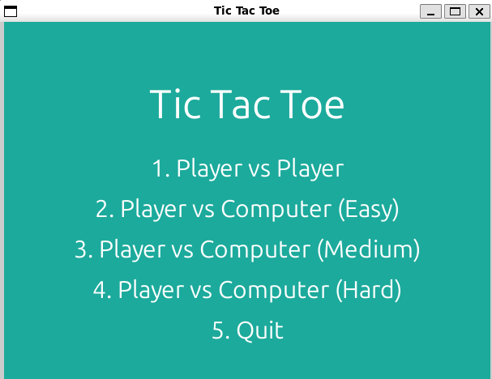
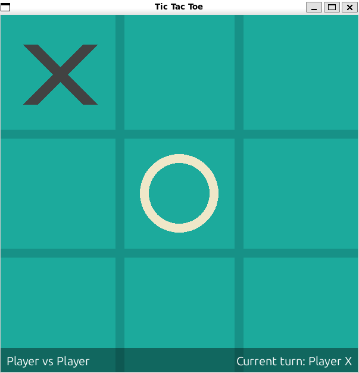
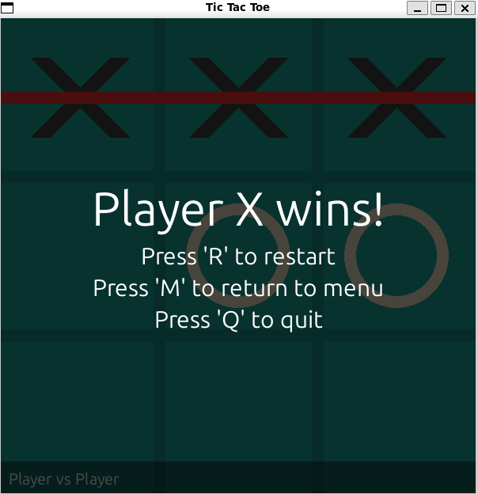

# Tic Tac Toe Game

A fully featured Tic Tac Toe game built with Python and Pygame, featuring multiple difficulty levels and game modes.


## Features

- **Multiple Game Modes**:
  - Player vs Player
  - Player vs Computer (with three difficulty levels)

- **Difficulty Levels**:
  - **Easy**: AI makes random legal moves
  - **Medium**: AI uses minimax algorithm with limited depth
  - **Hard**: AI uses full minimax algorithm with alpha-beta pruning (unbeatable)

- **User Interface**:
  - Clean graphical interface
  - Visual indicators for winning lines
  - Game information display
  - Menu system for game mode selection
  - End-game overlays with results and options

- **Controls**:
  - Mouse click to make moves
  - 'R' to restart the current game
  - 'M' to return to the main menu
  - 'Q' to quit the game

## Project Structure

```
tic-tac-toe/
├── main.py          # Main game entry point and game loop
├── game_logic.py    # Game state and rules management
├── board.py         # Board representation and operations
├── Ai_player.py     # AI opponent implementation
├── renderer.py      # Graphics and UI rendering
└── constants.py     # Game constants and configuration
```

## Components

### `main.py`
The main entry point for the game that initializes Pygame, handles the game loop, and manages transitions between different game states (menu, gameplay, exit).

### `game_logic.py`
Manages the core game rules, player turns, win/loss/draw detection, and coordinates the AI player when in PVC (Player vs Computer) mode.

### `board.py`
Represents the game board, tracks square states, and provides methods for checking wins and board state.

### `Ai_player.py`
Implements the computer opponent with three difficulty levels:
- Easy: Makes random valid moves
- Medium: Uses minimax algorithm with limited depth (more beatable)
- Hard: Uses full minimax algorithm with alpha-beta pruning (optimal play)

### `renderer.py`
Handles all visual elements including:
- Drawing the board grid
- Drawing X's and O's
- Rendering winning lines
- Creating overlays for game over states
- Displaying game information and instructions

### `constants.py`
Contains all game constants including:
- Screen dimensions
- Board configuration
- Colors
- Line widths and visual parameters

## Algorithm Details

The AI player uses the minimax algorithm with alpha-beta pruning optimization:

- **Minimax**: A recursive algorithm that simulates all possible game states to find the optimal move
- **Alpha-Beta Pruning**: An optimization technique that reduces the number of nodes evaluated
- **Depth Limiting**: Used in Medium difficulty to intentionally reduce AI strength by limiting search depth

## Installation and Running

1. Ensure you have Python 3.x installed
2. Install Pygame:
   ```
   pip install pygame
   ```
3. Run the game:
   ```
   python main.py
   ```

## Visual Guide

### Main Menu
The main menu allows players to select their preferred game mode and difficulty level:



- Simple and clean interface with 5 options
- Select an option by clicking or using number keys 1-5
- Customize the AI difficulty when playing against the computer

### Gameplay
The gameplay screen shows the current state of the game:



- Clear 3x3 grid with distinct X and O markers
- Information bar at the bottom shows:
  - Current game mode and difficulty
  - Whose turn it is (Player X or Player O/Computer)
- Click on any empty square to make your move

### Game Over
When the game ends, an overlay appears showing the result:



- Semi-transparent overlay with game result
- Red line highlights the winning combination
- Options to restart, return to menu, or quit
- Use keyboard shortcuts (R, M, Q) for quick actions

## Controls

- **In Menu**:
  - Click or press number keys (1-5) to select options
  - Press 5 or click "Quit" to exit

- **In Game**:
  - Click on a square to make a move
  - Press 'R' to restart the current game
  - Press 'M' to return to the menu
  - Press 'Q' to quit

## Future Improvements

Potential enhancements for future versions:
- Customizable board size (4x4, 5x5)
- Sound effects and background music
- Player statistics tracking
- Customizable themes
- Networked multiplayer

## License

This project is open source and available for educational purposes.